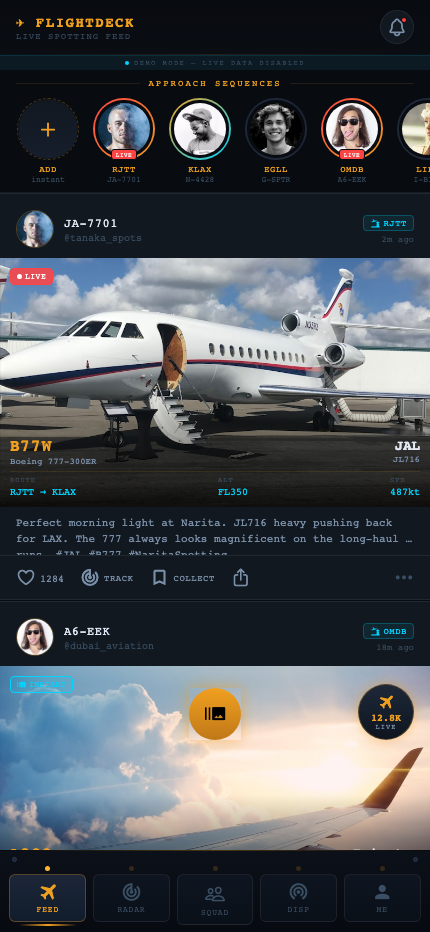
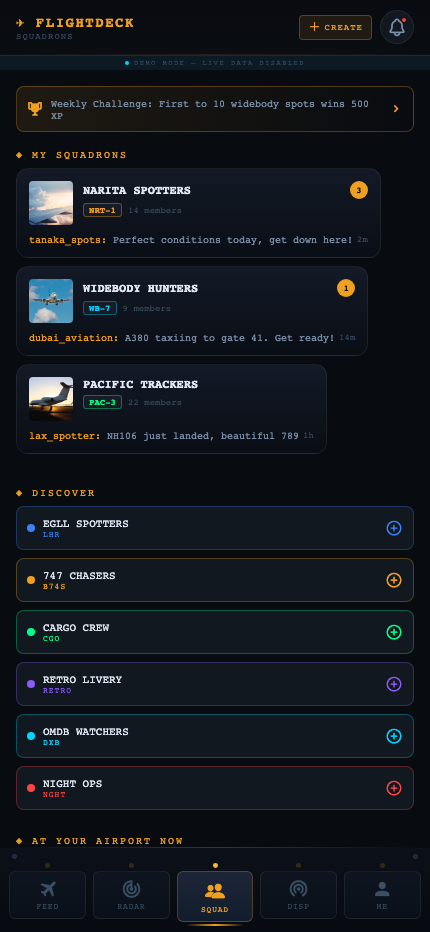
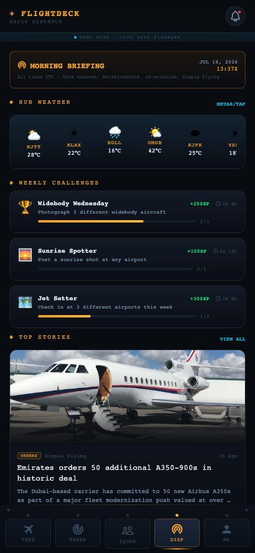
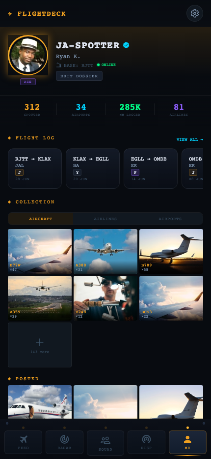

# ✈ FlightDeck — Aviation Social Platform

A full-stack aviation social app combining the best of Instagram, BeReal, Snapchat, and FlightRadar24 — built with React Native, Expo, and Supabase.

**🔗 [Live Demo](https://ryankuribayashi.github.io/flightdeck/)** — runs in Demo Mode with rich mock data, no login required.

---

## Screenshots

| Feed | Squadrons | Dispatch | Pilot Dossier |
|---|---|---|---|
|  |  |  |  |

---

## What It Does

FlightDeck is a community platform for aviation enthusiasts (plane spotters, frequent flyers, and aviation photographers) to share real-time spotting moments, track live air traffic, communicate in crew groups, and build a personal aviation identity — all in one cockpit-themed app.

---

## Features

### Feed & Stories
- **Approach Sequences** — Instagram-style story rings with LIVE badges and gradient overlays
- **Spotting Posts** — Aviation photos with HUD overlays showing ICAO type, route, altitude, and speed
- **Instant Snap** — BeReal-style dual-camera capture for front + rear spotting shots
- **Like & Collect** — Animated interaction buttons with haptic feedback

### Radar & Tracking
- **Global Flight Radar** — Embedded FlightRadar24 with in-app fallback on web
- **Nearby Aircraft** — Live proximity feed showing flights within 100nm
- **Tail Watchlist** — Personal list of registered aircraft to track with alert badges
- **AR Sky Scanner** — Point your camera at the sky to identify aircraft overhead with animated radar blips and slide-up data panels

### Squadrons (Groups)
- **Group Chats** — Squad-based messaging with unread badges and color-coded identity
- **Discover** — Browse and join squadrons by aircraft type, airport, or specialty
- **Who's at Your Airport** — Live check-in system showing spotters at your hub right now
- **Weekly Challenges** — XP-based competitions between squads (e.g. "First to 10 widebody spots")

### Dispatch (News & Briefing)
- **Morning Briefing** — Daily aviation news digest with UTC timestamp
- **Top Stories** — Full-card news articles with category tags and sources
- **Hub Weather** — METAR strip for major airports worldwide
- **On This Day** — Historical aviation events for today's date

### Pilot Dossier (Profile)
- **Pilot Card** — Callsign, rank ladder (Cadet → Legend), verified badge, home base
- **Stats Block** — Aircraft spotted, airports visited, nautical miles logged, airlines flown
- **Flight Log** — Personal cabin-class flight history with route cards
- **Collection** — Photo grid of spotted aircraft, airline roster, and airport passport
- **Posted Gallery** — All your uploaded spotting shots with ICAO type labels

### ATC Audio
- **LiveATC Feed** — Animated waveform player to monitor tower frequencies at any ICAO airport
- **Standby Pulse** — Waveform stays gently animated even when audio is off

---

## Tech Stack

| Layer | Technology |
|---|---|
| Framework | React Native + Expo SDK 57 (managed workflow) |
| Routing | Expo Router v3 (file-based, typed routes) |
| Language | TypeScript 6 (strict mode, 0 errors) |
| State | Zustand |
| Backend | Supabase (PostgreSQL + Auth + Realtime + Storage) |
| Animations | React Native Reanimated v4 + Worklets |
| Gestures | React Native Gesture Handler |
| Camera | expo-camera (CameraView + permissions API) |
| Styling | expo-linear-gradient, expo-blur (glassmorphism) |
| Icons | @expo/vector-icons (MaterialCommunityIcons, Ionicons) |
| Token Storage | expo-secure-store (persistent auth sessions) |
| Deployment | Expo web export (static) |

---

## Architecture Highlights

- **Demo Mode** — App runs fully with rich mock data when Supabase credentials aren't configured. A "DEMO MODE" banner appears in the header. Zero crash, zero blocked flows.
- **Phone Frame** — On desktop web (≥900px), the app renders inside a realistic iPhone 15 Pro frame with animated side panels, dynamic island, and a cockpit-themed info layout.
- **Cockpit Navigation** — Custom bottom tab bar with LED indicator lights, spring-press animations, amber glow accents, and panel screws replacing the default React Navigation tab bar.
- **Real-time Backend** — Supabase Realtime subscriptions push new posts to the feed instantly. Row-Level Security protects all tables.
- **ActionSheet System** — Every user action opens a cockpit-style bottom sheet (no native Alert dialogs) with icons, sub-labels, and destructive action support.

---

## Database Schema

```
profiles        — user identity, callsign, rank, home airport
posts           — spotting shots with ICAO metadata
stories         — 24-hour approach sequences
squadrons       — group identity and membership
squadron_members— join table with role field
messages        — real-time group chat
tail_watchlist  — registered aircraft tracking per user
flight_log      — personal cabin-class flight history
likes           — post engagement
```

All tables have Row-Level Security (RLS) policies. Storage buckets: `posts`, `avatars`, `stories`.

---

## Getting Started

```bash
git clone https://github.com/<your-username>/flightdeck
cd flightdeck
npm install

# Run on web (demo mode — no Supabase required)
npx expo start --web

# Or native
npx expo start
```

To enable live data, create a Supabase project, run `supabase/schema.sql`, and set:
```
EXPO_PUBLIC_SUPABASE_URL=https://your-project.supabase.co
EXPO_PUBLIC_SUPABASE_ANON_KEY=your-anon-key
```

---

## Screens

| Route | Screen |
|---|---|
| `/(tabs)/feed` | Live spotting feed + stories |
| `/(tabs)/radar` | Global radar, nearby, watchlist, ATC |
| `/(tabs)/squadrons` | Groups, discover, airport check-in |
| `/(tabs)/dispatch` | News briefing, challenges, weather |
| `/(tabs)/dossier` | Pilot profile, flight log, collection |
| `/(modals)/ar-scanner` | AR sky scanner with camera |
| `/(auth)/login` | Cockpit-themed pilot authentication |
| `/(auth)/signup` | 3-step callsign + base + credentials flow |

---

## Problem It Solves

Aviation spotting is currently fragmented across a dozen apps — FlightRadar24 for tracking, Instagram for sharing, WhatsApp for group chats, Airfleets for history. FlightDeck unifies all of it into a single identity-driven platform built specifically for the aviation community, with the visual language of an instrument panel rather than a generic social feed.

---

*Built with React Native · Expo · Supabase · TypeScript*
